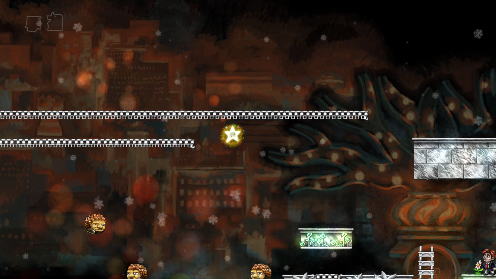

# braidcam
Command-line tool for manipulating the camera in the puzzle-platform game Braid.

```
braidcam            // Toggle camera lock/unlock
braidcam lock       // Lock camera in current position
braidcam lock x y   // Lock camera in specified position
braidcam unlock     // Unlock camera
```

