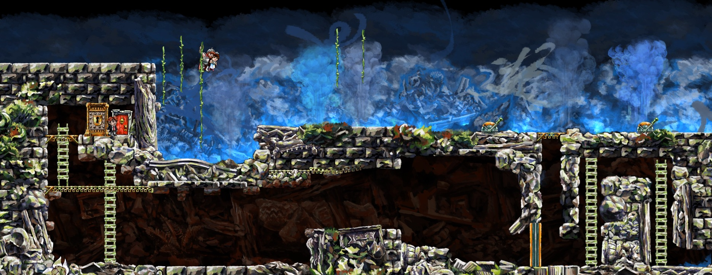

# braidkit
Command-line tool for manipulating and modifying the puzzle-platform game Braid.

##
```
braidkit camera-lock           // Lock camera at current position
braidkit camera-lock 10 20     // Lock camera at x=10 y=20
braidkit camera-lock toggle    // Toggle camera lock/unlock
braidkit camera-lock unlock    // Unlock camera
braidkit camera-zoom 0.5       // Zoom out camera
braidkit camera-zoom reset     // Reset camera to default zoom
braidkit tim-position 10 20    // Move Tim to x=10 y=20
braidkit tim-position 10 20 -r // Move Tim by x=10 y=20 relative to current position
braidkit tim-velocity 100 200  // Set Tim's velocity to x=100 y=200
braidkit tim-speed 2.0         // Set Tim's speed to 200 %
braidkit tim-jump 1.5          // Set Tim's jump to 150 %
braidkit bg-full-speed         // Toggle game running at full speed in background
braidkit debug-info            // Toggle in-game debug info
braidkit -h                    // Show help
```

